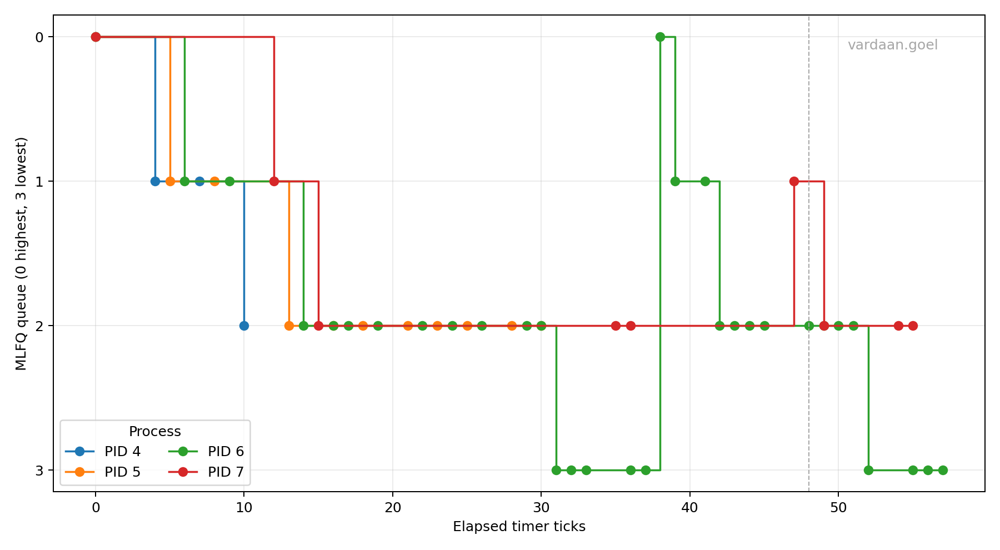

# Report

The Makefile selects one scheduler when compiles. 'SCHEDULER=MLFQ' selects MLFQ, 'SCHEDULER=FCFS' selects FCFS, and by default, RR is selected.

'struct proc' stores MLFQ queue, ticks in current slice, sequence numbers, and the last boost time. New processes are initialized in queue 0. Processes receive an increasing sequence number, which gives FIFO order inside each queue.

The scheduler scans queues 0 through 3 and chooses the process with the smallest sequence number in the highest queue that's not empty. The process's slice counter is incremented. A process that completes its slice goes to lower queue, and is reinserted at the tail. Processes that sleep before completing their slice retain their queue and are assigned a new tail position when woken.

Every 48 timer ticks, all non-zombie processes are moved to queue 0 and their current slice counters are reset. 'procdump()' gives the PID, state, name, queue, ticks, sequence, and last boost tick.

The custom 'user/schedulertest.c' creates children with 12, 28 and 56 tick gaps and one I/O like child that does short cpu bursts follwed by pauses.

The 'schedstats' system call gives arrival tick, first tick, CPU ticks, and ready ticks to the test program. Each child prints turnaround, waiting, and response values immediately. This is used to test and compare the policies.

The plot script requires Python 3 with `pandas` and `matplotlib`. It watermarks the plot generated by the Python file with `vardaan.goel`.

It marks each 48-tick boost with a vertical dashed line. CPU-bound processes should move toward lower-priority queues as their slices are exhausted. The I/O-like process should usually retain a higher queue because it sleeps before using a full slice. At each boost, active processes return to queue 0, reducing starvation for processes that have waited in lower queues.

The submitted plot data uses the CSV columns `tick`, `pid`, and `queue`. The plotting script normalizes the x-axis so the first workload observation is elapsed tick 0.

## Comparison

Run the same workload with FCFS, RR and MLFQ. Compute:

- Turnaround time = completion tick - arrival tick
- Response time = first-run tick - arrival tick
- Waiting time = total `RUNNABLE` ticks reported by the kernel

| Scheduler | Average turnaround | Average waiting | Average response |
|---|---:|---:|---:|
| FCFS | 73.00 | 37.00 | 37.00 |
| RR | 40.25 | 19.25 | 1.50 |
| MLFQ | 39.75 | 18.75 | 1.50 |

For this given workload, FCFS has the worst averages because the 56-tick CPU-bound process runs before the I/O-like process. RR reduces average response time to 1.50 ticks by sharing the CPU, while its average waiting time is 19.25 ticks. MLFQ has a similar response time and slightly lower waiting and turnaround values because CPU-bound processes are demoted while the interactive process is favored. The MLFQ trace shows PID 6 moving through queues 1, 2, and 3, then returning to queue 0 at tick 192 during the boost. FCFS minimizes scheduling overhead but provides poor response time for processes arriving behind long CPU bursts. RR improves fairness because every runnable process receives regular CPU access. MLFQ combines short response time for new and interactive processes with gradual demotion of CPU-bound processes, while the periodic boost prevents starvation.

The custom scheduler test prints per-process comparison metrics. The captured observations are stored in `analysis/events.csv`, and the watermarked plot generated from them is `analysis/mlfq-timeline.png`.
